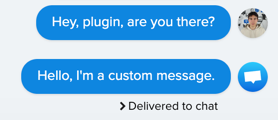

# Crisp plugin Node.js example

This simple plugin shows you how to create a plugin using https://github.com/crisp-im/node-crisp-api.

## Setup for a plugin

1. Create an account on the [Crisp Marketplace].
2. Create a plugin on the Marketplace. (Add its URN in `./lib/pong_plugin.js` > `pluginUrn ` URN example: `"urn:my.account:pluginname:0"`)
3. In the Marketplace go to the **API tab of your plugin** and add your Identifier & Key in the appropriate fields (located in `./lib/pong_plugin.js`:

    * crispAPIIdentifier `(ex: ac5a9650-903e-4xc4-90cf-87a954fz275d)`, 

    * crispAPIKey `(ex: az7492b632087682715e5f8r0359052714e52f5cbf3152f58be4580cdb40e3e)`).
    
4. Now switch to the **Settings tab of your plugin** and:
    * Add your plugin config HTTPS url. To achieve that you can use https://ngrok.com/, it will help you bind a public HTTPS address to your local server.
        * Example - Settings URL: `https://a1e9e89c2d80.ngrok.io/config.html`
    * Add your plugin custom settings schema. For this example you can use the config file available at `./schema.json`. (Please change the URN to match yours.)
5. Go in **Settings (from the left sidebar)** and add a Trusted Website. This will help you test your plugin on your Crisp Website before publishing it. You can find the documentation on how to find the website ID of your Crisp chat here: https://help.crisp.chat/en/article/how-to-find-the-website-id-1ylqx1s/

From there you can start building your own plugin! You can use the API reference for help: https://docs.crisp.chat/api/v1/.
If you want to have a first glance of a plugin, you can start the ping-pong plugin example by following the next instructions.

## Start the plugin example

This plugin will send a custom message whenever an operator/agent sends a message. The message content is based on the config that you have chosen.

1. In the project root, run: `npm install && node ./lib/index.js`
2. You should now see in your terminal: `Plugin now listening...`. 
3. Configure the custom message: Go in [Crisp Marketplace] > your plugin > Settings > Send test request. A popup will appear showing what your users will see when configuring their plugin instance. Choose your message and click "Save".
3. In your Crisp inbox, create a new test conversation, with yourself for example.
4. Send a message.

Response example:

[Crisp Marketplace]: https://marketplace.crisp.chat/
